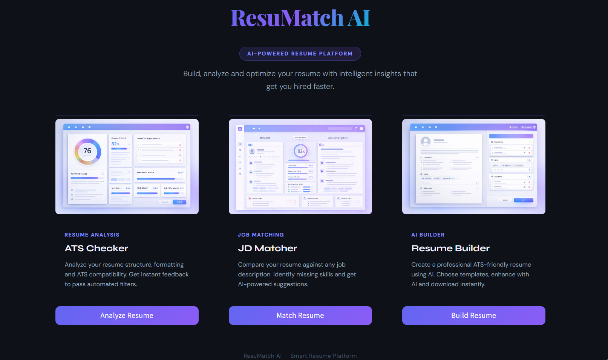

# ResuMatch AI
### Build, Analyze & Optimize Your Resume with AI

> An AI-powered resume platform featuring ATS analysis, job description matching, and an AI-assisted resume builder.

<br>

<p align="center">
  
</p>

<br>

<p align="center">
  <a href="https://resumatch-ai-pro.streamlit.app/">
    
  </a>
</p>

---

## Overview

ResuMatch AI is a full-stack AI-powered resume platform that helps job seekers understand exactly how their resume performs — and how to improve it. It combines rule-based ATS scoring, skill-gap analysis, and generative AI to give actionable, personalized feedback in seconds.

Built as a production-grade Streamlit application with a premium UI, secure API handling, and cloud deployment.

---

## Features

### ATS Checker
- Upload a resume PDF and extract text automatically
- Score across 10 weighted dimensions — sections, skills, experience quality, formatting, contact info, education, summary, certifications, keywords, and length
- Animated canvas-based score gauge
- AI-generated improvement suggestions and recommended job roles

### JD Matcher
- Upload resume and paste any job description
- Extract and compare skills from both using a curated skills database
- Identify matching skills and skill gaps instantly
- AI-powered suggestions across improvements, skills to add, and resume tips

### Resume Builder
- Choose from 3 professionally designed templates — Modern, Minimal, Classic
- Structured form for all resume sections
- AI enhancement — auto-generates summary and project descriptions
- Live preview with one-click download
- Smart score detection — enter `8.5` or `85%` and it formats as CGPA or percentage automatically

---

## Tech Stack

| Layer | Technology |
|---|---|
| Frontend / UI | Streamlit |
| Backend | Python |
| AI Integration | OpenRouter API with fallback system |
| Resume Parsing | pdfplumber, PyPDF2 |
| ML / Scoring | scikit-learn, custom rule engine |
| Visualization | HTML5 Canvas animated gauge |
| Deployment | Streamlit Cloud |

---

## Project Structure

```
resumatch-ai/
│
├── app.py                  # Main homepage UI
│
├── core/
│   ├── ats.py              # ATS scoring engine
│   ├── matcher.py          # JD matching logic
│   ├── builder.py          # Resume generation
│   ├── parser.py           # PDF text extraction
│   ├── genai.py            # OpenRouter API integration
│   └── fallback.py         # Fallback logic
│
├── page_views/
│   ├── ats_page.py         # ATS Checker page
│   ├── jd_page.py          # JD Matcher page
│   └── builder_page.py     # Resume Builder page
│
├── templates/
│   ├── modern.html
│   ├── minimal.html
│   └── classic.html
│
├── assets/                 # UI images
├── data/skills.json        # Curated skills database
├── .env                    # API keys
└── requirements.txt
```

---

## ATS Scoring Breakdown

| Dimension | Max Points |
|---|---|
| Experience quality | 30 |
| Resume length | 15 |
| Keywords | 10 |
| Skills match | 10 |
| Sections presence | 10 |
| Formatting | 10 |
| Contact info | 5 |
| Education | 5 |
| Summary | 5 |
| Certifications | 5 |
| **Total** | **~105 (clamped to 100)** |

Garbage detection penalty: up to −30 points for unreadable or low-quality content.

---

## Setup and Installation

```bash
# Clone the repository
git clone https://github.com/aryan-pandey00/resumatch-ai
cd resumatch-ai

# Create virtual environment
python -m venv .venv
source .venv/bin/activate        # Mac/Linux
.venv\Scripts\activate           # Windows

# Install dependencies
pip install -r requirements.txt
```

Create a `.env` file in the root directory:
```
OPENROUTER_API_KEY=your_api_key_here
```

Run the app:
```bash
streamlit run app.py
```

---

## Key Engineering Decisions

**Custom navigation** — Session-state based routing instead of Streamlit's multi-page system for full control over transitions and state.

**Canvas gauge** — Built with HTML5 Canvas via `st.components.v1.html` instead of Plotly for a premium animated experience.

**AI with fallback** — Every AI call has a structured fallback so the app never breaks if the API is unavailable.

**Dark mode support** — Full adaptive theming via CSS variables and `prefers-color-scheme` media queries across all pages.

---

## Developer

**Aryan Kumar Pandey**

---

<p align="center">ResuMatch AI &mdash; Smart Resume Platform</p>
